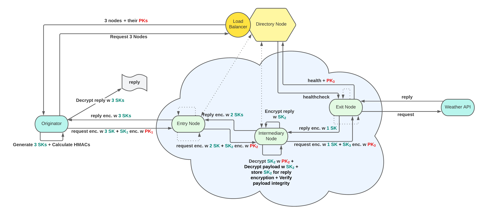

# Advanced Internet Computing WS 2022 - Group 7 Topic 4

## Team (and contributions)

- **Teodor Janez Podobnik, e12206639@student.tuwien.ac.at**:
    - Chain node 
    - Documentation
    - GitLab project administration (PRs, structure, issues)
    - Unit Tests
    - Docker related things

- **Julian Schwarzenböck, e11723121@student.tuwien.ac.at**:
    - docker
    - docker compose
    - docker swarm
    - Documentation
    - gitignores, dockerignore

- **Alexander Irsigler, e12229935@student.tuwien.ac.at**:
    - Directory Node
    - Converting the `client` from a python CLI app to a web frontend application
        - Flask
        - HTML Templating + CSS
    - Logging client, chain_node, directory_node
    - Documentation, Testing client, directory_node
    - Health checking

## Minimal requirements

This project was tested using:

- **Python 3.10** on a **Linux Ubuntu 20.04/amd64 architecture** with Docker installed.   
- Arch Linux (Rolling Release, 2023-01-23) with Docker 20.10.22  
- Debian bookworm (Rolling release - Testing) with Docker version 20.10.22, build 3a2c30b

## Overview

The increasing popularity of the Internet of Things (IoT) has caused exponential growth in the number of connected devices to overlay networks. Often, these devices provide their sensory information as a public service (e.g., in a Smart City). As a simple scenario, consider that Smart Home Systems may use some of these open services for accessing data promptly (e.g., weather data). However, this may pose a risk to identify a user’s location. Thereby, it is desirable that open services must be accessed anonymously. Therefore, in this project, we developed a Docker-based anonymity system using onion routing. 

Onion routing is a well-known basic principle for providing anonymous communication and has been implemented, e.g., in Tor. The basic idea of onion routing is to obfuscate the identity of a user by routing a message (e.g., a request for an IoT Service) via different intermediary nodes (routers) and decrypting or encrypting, respectively, the message at every single node.

## Architecture

## Components

The architecture consist of the following components:

- **Central directory node** - controls chain nodes, i.e., starts new containers.

- **Originator/Client (Frontend)** - receives a chain from the directory node. This chain will be used to route requests or responses within this onion routing infrastructure and display the Weather API data as a web page.

- **Chain nodes** - route requests respectively responses based on routing information received from the originator.

- **Weather API Server** - Flask API serving weather data.

All components are orchestrated by **Docker Swarm** with a strict fault tolerant policy. For more information about each component, relate to `READMEs` in the corresponding subdirectories.

## Fault Tolerance Policy

A strict fault tolerance policy was devised to cope with failures and unexpected exceptions. 

It would be best if all failures would be detected in a split second as well as fixed but at the moment the following rules apply:
- On an internal container error it takes about **30 seconds** to mark container as unhealthy and restart it
- In case there's a complete container crash it gets immediately restarted
- If client fails to receive a response it resend its request through a new route

All errors or failure logs should be visible on the frontend to better understand the nature of the underlaying problem. 

## How to run

In order to run the project, make sure you have a clean Docker environment. In case you've run it before and you encounter start up issue, relate to this subsections for troubleshooting.

Then run the architecture using:

	make start

This spawns **directory node**, 6 replicated **chain nodes**, the **client/frontend** and the **weather API Server**. 

After all the nodes finish their start-up procedure, the WebApp is available on <http://localhost:5002>.

## How to shut-down

To shut down all components, run:

    make stop

After that you can safely clean up all resources, by running:

    make purge

## How to debug

There should be sufficient output information in the frontend to tell you what's going on with the system.  
If you encounter any issues, try looking into **docker logs** since all components are spawned inside Docker containers.

**Step 1**- Get list of container-IDs:

    docker ps -a

**Step 2**- Access logs:

    docker logs <CONTAINER-ID>

## How to run without Docker Swarm

Legacy-mode is managed by **docker-compose** instead of being an orchestrated **docker-swarm**.

In order to run it, make sure you have a clean Docker environment. In case you've run it before and you encounter start up issue, relate to this subsections for troubleshooting.

Then run the architecture in legacy-mode using:

    make legacy-mode

This spawns **directory node**, 4 **chain nodes**, the **client/frontend** and the **weather API Server**.
You will see a detailed log of what's going on in your terminal.

After all the nodes finish their start-up procedure, the WebApp is available on <http://localhost:5002>.

To stop it you can either **Ctrl+C** or better use:

	make purge

## Troubleshooting

There might be startup-related issues due to dangling resources or misconfigured environment. Before reporting an issue, try running:

	make purge

or by completely cleaning the Docker environment using:

    docker system prune

