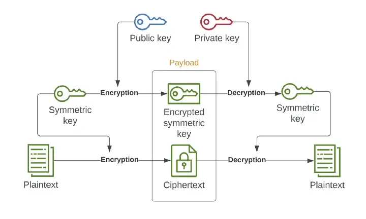
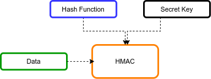

# Chain node

Chain node is the main component that routes information through the ToR network while decrypting and encrypting payload on-the-fly to preserve the client anonymity. 

## Types

There are 3 types of chain nodes:
- Entry
- Intermediary
- Exit

At the moment there's no significant difference between them, but we might consider preserving the list of **Entry** and **Exit nodes** private for security reason - they can easily get blocked (e.g. by Government) this way users are prevented to use the ToR service. 

## How to Run

If you want to run the whole architecture, relate to the root `README.md`. In case you want to tests the specific functionality of the chain-node without other feature follow the steps below.

**Before spawning any chain-node, make sure the directory-node is running** - because on start-up the chain-node tries to authenticate to the directory to announce its availability.

Then open 3 new terminals and in each run one of the commands:

	pipenv run flask --env-file .env.entry run --port 9001
	pipenv run flask --env-file .env.intermediate run --port 9002
	pipenv run flask --env-file .env.exit run --port 9003

## Internal workings

On chain node boot it generates an RSA public and private key pair and authenticates to the directory node using:

        {
           'name': [random name],
           'kind': [entry, intermediate, exit],
           'address': [hostname:port],
           'public_key': [RSA public key - PEM encoding] 
        }

Each chain node acts as a API Server (listening on some pre-configured port) that internally forwards request to next nodes in the chain. 

### Request routing

Messages are transferred in JSON format. The message it receives depends upon the order of the chain nodes, but each has the following structure:

        {
            'enc_key': [encrypted symetric key - BASE64 encoding],
            'enc_payload': [encrypted payload - BASE64 encoding],
            'hmac': [MAC - HEX encoding]
    
        }

First an HMAC is calculated from:

        {
            'enc_key': [encrypted symetric key - BASE64 encoding],
            'enc_payload': [encrypted payload - BASE64 encoding],
        }

and checked whether it matches **hmac** value in the message.

Then the **enc_key** symmetric encryption key is decrypted using the Chain node (unique) RSA private key and then usen to decrypt the **enc_payload**. **enc_payload** consist of:

        {
            'dst': [next chain node address],
            'enc_payload': [encrypted payload for next chain node],
            'endpoint': [optional-endpoint]
        }

**enc_payload** for the next chain node is sent forward to the **dst** that perform the same steps as described above until it reaches the API Server. There is an optional **endpoint** key that can be used to send traffic on a speicif API Server endpoint.

### Reply routing

During **Request routing** decrypted symmetric key is stored and used to encrypt payload during reply routing such that API Server reply gets three-times encrypted on the way and consequently recursively decrypted on the client site.

## Cryptography

The main feature of the ToR network itself is the cryptography algorithm used to ensure **secrecy**, **integrity** and prevent attackers from distinguishing different messages flowing in and out of the network.

### Secrecy

To preserve secrecy a hybrid-encryption scheme is used whose functionality is depicted in the image below:

### Integrity

Integrity is preserved using HMAC (Message Authentication Code) that ensures message is not tampered e.g. by an MITM while flowing from source to the destination. Only forward integrity is checked, because IRL we don't have control over the API Server. 

Althought signifact research has been done on preserving the backward integrity - still only too complex algorithm are available which are out of the scope for this project.

<object data="https://hyde.infosys.tuwien.ac.at/aic22/G7T4/-/blob/main/chain_node/assets/OR_w_replies.pdf" type="application/pdf" width="700px" height="700px">
    <embed src="https://hyde.infosys.tuwien.ac.at/aic22/G7T4/-/blob/main/chain_node/assets/OR_w_replies.pdf">
        
For more information, take a look at the following paper: <a href="https://hyde.infosys.tuwien.ac.at/aic22/G7T4/-/blob/main/chain_node/assets/OR_w_replies.pdf">Open PDF</a>.

    </embed>
</object>

### Padding

Message length is randomized from Entry to Exit node and response as well using padding to prevent attackers from distinguishing different messages and exploiting the originator and the end API Server. For padding we use a (random-length) zero-es (0) that gets stripped of on the receiving site and appended on the sending site.

