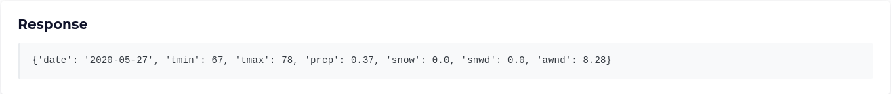

# Client 

Frontend application for OnionWeather service, built with Flask + Cirrus CSS.

## Interface

Frontend consists of a simple button and some logging to provide the user enough information of what's going on behind the scenes.

By clicking on **GET WEATHER** button. The client besides requesting the chain route from the directory-node also makes a request to the Weather API through the Onion Routing network and renders the response on the frontend:



It also displays which nodes were utilized to route packets through the network:


as well as how the message was routed and modified through the network:


## How to run

If you want to run the whole architecture, checkout the root `README`. If you want to only run the frontend you can use the following commands:

```bash
# optional, default: http://localhost:5000
$ export DIRECTORY_NODE_URL=http://localhost:1234

$ make dev
```

Then, open <http://localhost:5001>.
