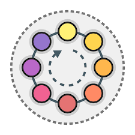

# Directory node

Directory node is the main orchestrator in the architecture. Not only does it **preserve the list of available chain-nodes** but also **makes sure client gets a fresh and randomized list of nodes** everytime it wants to route its messages.

## Loadbalancing

The directory node provides a basic load balancing: If an originator asks for “new” nodes to build a chain, the directory node chooses three chain nodes using **round-robin**.

In a basic **round-robin** fashion all the nodes get utilized in a equally distributed manner.

 This is ensured by the following rules:
- The first time a client requests a list of chain-nodes, all the available nodes get **ordered in a random but fixed queue**
- On every subsequent client request the next **3 nodes in the queue get retrieved**
- In order to cope with an attacker that might look for network patterns, **directory-node always mixes the 3 nodes before sending it to client** (higher randomness of the route)

## Healthchecking

All the spawned chain-nodes perform a simple health-based test on a `/node/health` API endpoint **every 5 seconds** to announce they are healthy, up and working. 

## How to run

In case you want to run the full architecture, take a look into the root `README`. But if you only want to test a specific functionality of the directory-node you can run it using:

	pipenv run flask --app app run --host 0.0.0.0

**NOTE**: You should run this using at least **Python version 3.10**. No need to concern about that if you run the architecture using our Docker files, since they are preconfigured to it.

## Testing

We provide a simple unit tests so you can see how to work with directory node and ensure the functionalities work. 

You can run the unit tests using:

	pipenv run python tests/api_test.py

